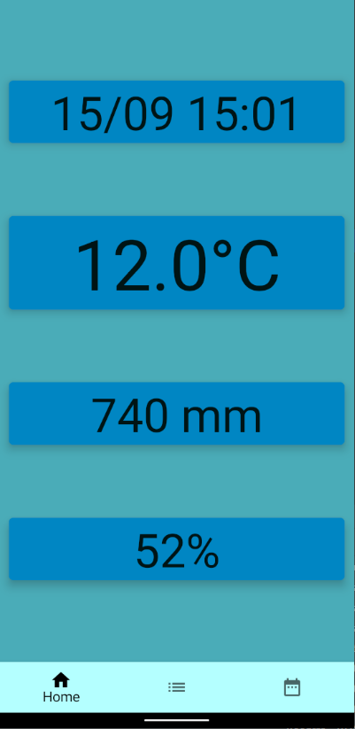
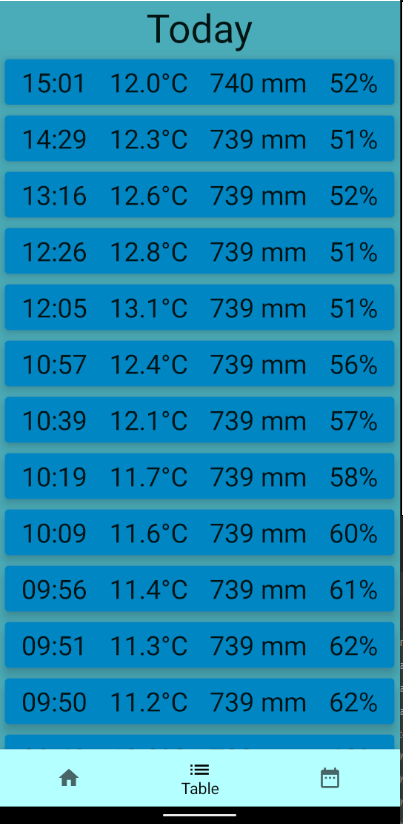

# ComposeWeather

Weather application based on self made Arduino weather station with Raspberry Pi Rest api server, made with Jetpack Compose

### Key tech
+ Jetpack compose
+ MVVM
+ Retrofit
+ RxKotlin
+ Room (disabled)
+ Dagger

---
1. Indication screen. Background based on season (summer, autumn, winter, spring). Temp color changes

2. Table (RecyclerView)

