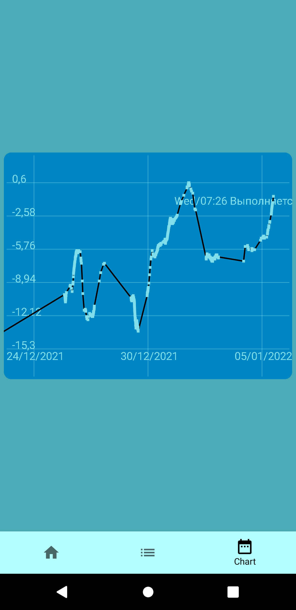

# ComposeWeather

Weather application based on self made Arduino weather station with Raspberry Pi Rest api server, and UI made with Jetpack Compose

### Key tech in this App 
+ Jetpack compose
+ MVVM
+ Retrofit
+ RxKotlin
+ Dagger
+ Room (disabled)

---
1. Indication screen.

2. Table (RecyclerView)

3. ChartView. I've made own [Chart library](https://github.com/Voodstr/CoChartSample).

